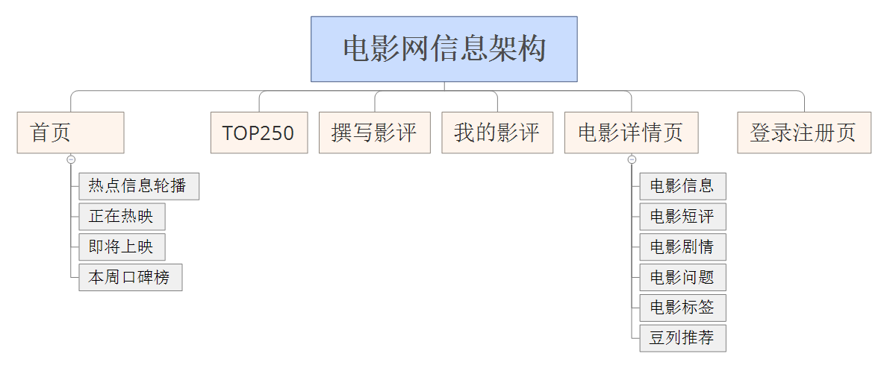
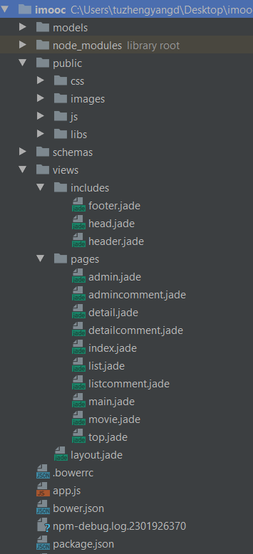
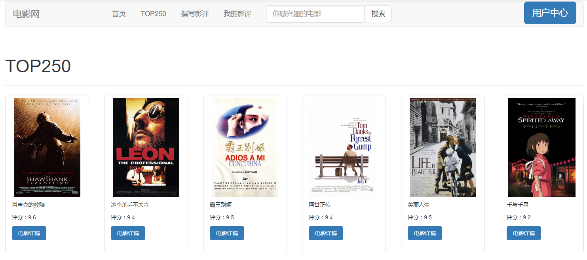
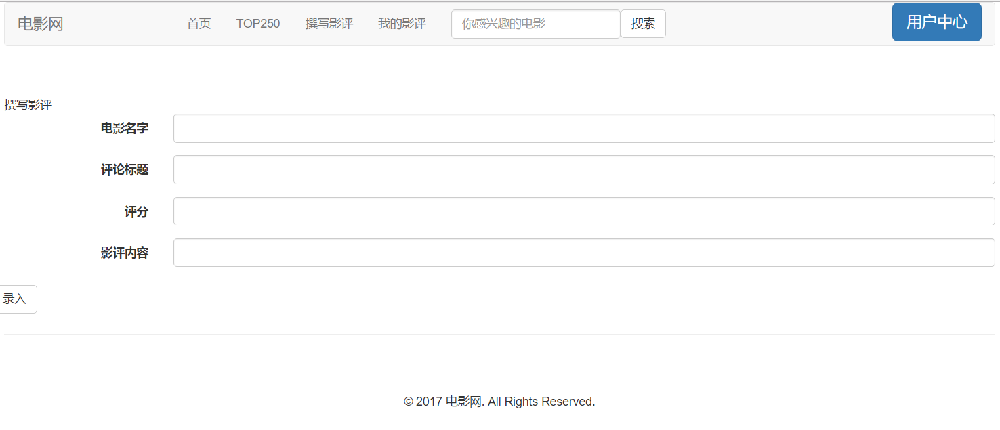
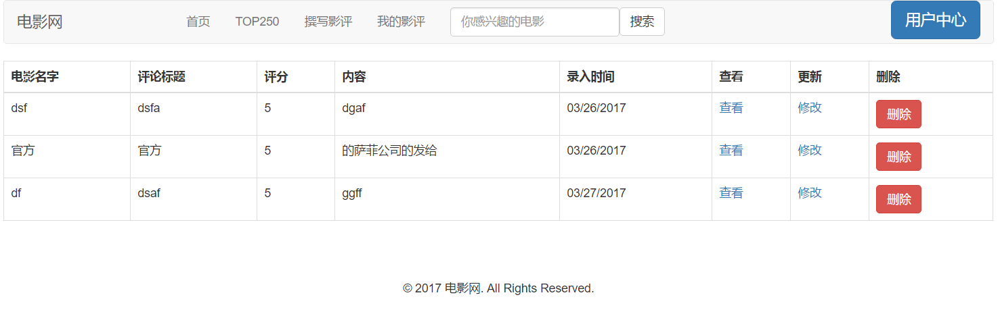
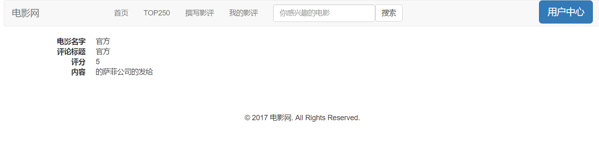
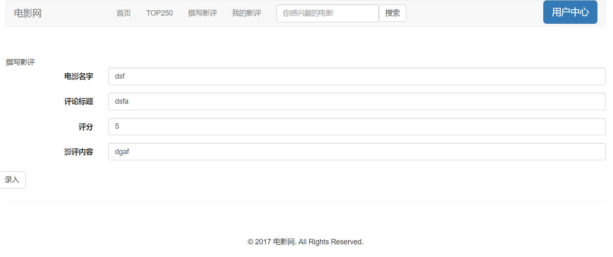

# imooc
这是一个自己做的一个小项目。参考资料来自慕课网。在案例的基础上增加了撰写评论以及查看评论功能。附上学习地址，http://www.imooc.com/learn/75   
此次电影网的搭建用了许多的技术，如前端使用了bootstrap作为UI框架，并使用了jquery完成ajax操作，用jade模板引擎进行具体页面的制作。而后端以nodejs（路由使用的express）搭配mongodb（使用了mongoose）来写。使用了bower进行各类包的管理。
这是我第一次使用bootstrap这种ui框架进行建站，bootstrap的栅格系统非常好用，此外移动优先的设计理念也非常值得学习。以后应该多多研究下bootstrap的源码进行相关css和js的学习。  
Mongodb和nodejs也是第一次接触，mongodb的运用过程中没有使用图形化的界面，命令行用起来有点心累，很容易出错。Mongodb中schema,model,entity的概念是之前没接触过的，这次的建站没有运用到entity这个知识点。这三个的概念如下：Schema：一种以文件形式存储的数据库模型骨架，不具备数据库的操作能力。Model：由Schema发布生成的模型，具有抽象属性和行为的数据库操作。Entity：由Model创建的实体，他的操作也会影响数据库。  
Jade（Pug）模板引擎也是非常好用，如页头页尾都可以通过模板引擎进行复用。  
此外电影网的数据来源于豆瓣的接口，感谢豆瓣，附上接口链接。https://developers.douban.com/wiki/?title=movie_v2

1.网站主题：电影信息网站。包括电影信息的查看以及影评的撰写。类似于豆瓣。

2.信息结构
  

3.站点文件结构  
站点文件结构如下：  
   
models以及schemas文件夹中存放的为mongodb的数据。  
node_modules文件夹中存放的各类包如bower等。  
Public文件夹中存放的各类网站的公共资源，包括css、images、js还有libs库。  
views文件夹中存放的网页代码，incluedes中存放的公用的代码，如网站头部底部。Pages中存放的是具体页面的代码。Main为首页，top为top250，movie为电影详情页，detailcomment为评论详情页，admincomment为评论录入页，listcomment为评论列表页。  
app.js为网站的入口文件。  
bower.json是bower的配置文件。  
.bowerrc存放的bower包安装的路径。  
Package.json是npm的配置文件。  

 

4.主要网页外观风格设计  
本次网站使用bootstrap进行搭建，风格简洁优雅，以黑白蓝为主色调。

5.页面预览

首页：
 
 
TOP250：
  
 
撰写影评：
  
我的影评：
  
影评详情：
  
修改影评：
  
登陆注册：
  
 

